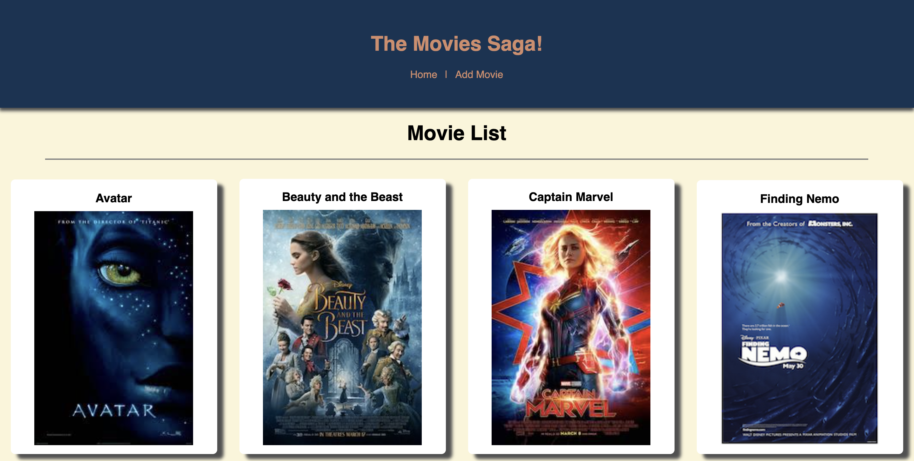
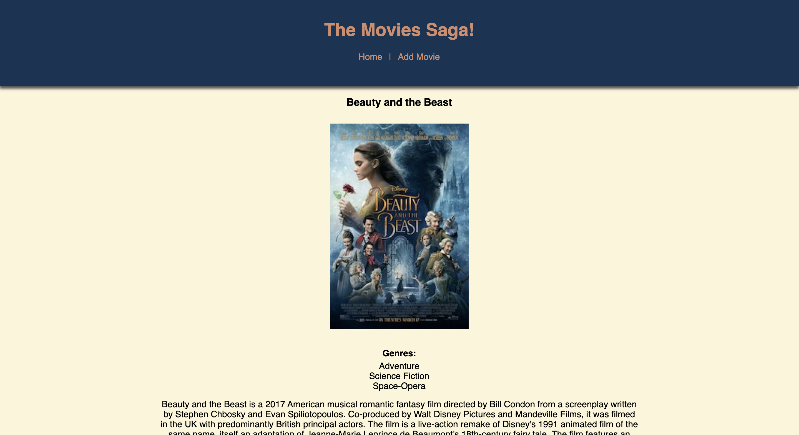
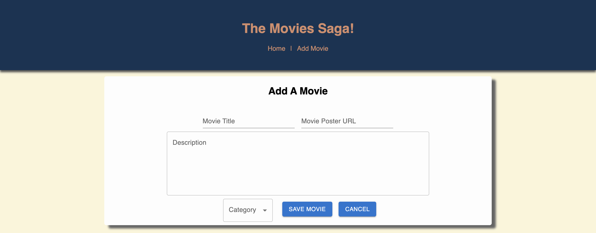
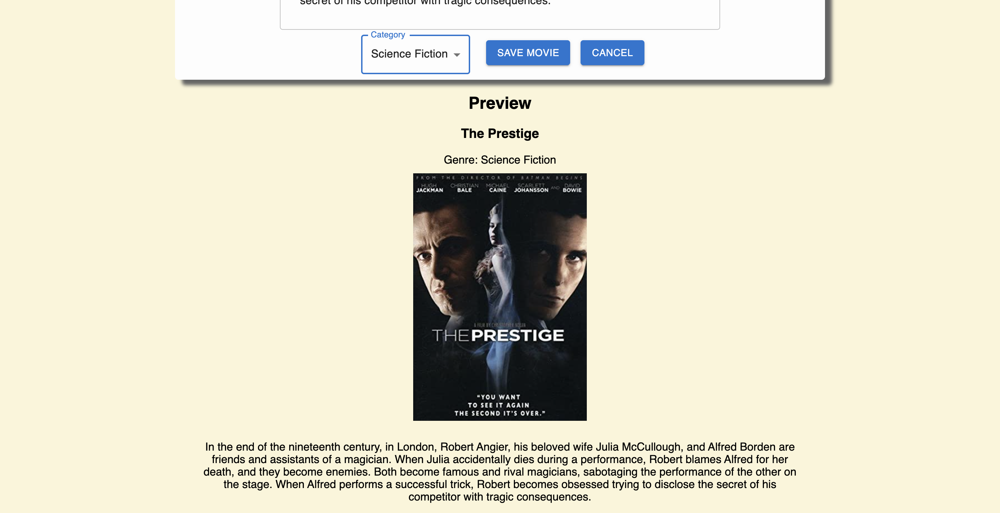

# Weekend Movie Sagas App

## Description

*Duration: Weekend Project*

This movie list/movie holder is a fullstack full CRUD app. Users can see the title and the poster of their movies on the home page. Clicking on the movie poster will bring them to a details page for that movie. Users can also add more movies to their database using the added form.

## Screen Shot
___

Users can see all the movies in their database in a list.



Clicking on a poster will bring them to the details page.



Users can add a movie by filling in the title, url of the poster, description, and picking a category.



While filling in the add a movie forms users can see a preview of their movie and its details.



### Prerequisites

- Node.js
- axios
- React
- Redux
- Postgresql
- MaterialUI
- Sweetalert

## Installation
___

1. Fork and clone.
2. Type ```npm init --yes``` into the in-app terminal.
3. Once thats done type ```npm install``` in the IDE terminal.
4. You'll have to set up the database in postgresql. Make sure you name it 'saga_movies_weekend'.
5. Then set up the table by taking the commands in the database.sql file in the IDE and running them in postgresql.
6. Start your server by typing ```npm run server``` in the IDE terminal.
7. Start your client by typing ```npm run client``` in the IDE terminal.
8. Everything is good to go now! Don't forget to shut down your server when you're done!

## Usage
___

1. Click on a movie or add a new movie.
2. Clicking on a movie will bring you to the details page of that movie.
    - The details page of the movie displays the title, the genres associated with it, the poster, and the description. At the end of the page there is a button to bring you back to the main list.
3. Clicking the add movie link at the top of the page will bring you to the add movie component.
4. Here you can add new movies to the database.
5. Type in all the relevant details for your movie, choose a poster url and a category from the drop down.
6. Before you hit submit, scrolling down will bring to you to preview of your movie.
7. Once you're happy with your new movie, you can hit submit. Or you can hit cancel to bring you back to the main list of movies.

## Built With
___

- JavaScript
- React
- Redux
- Node.js
- Express
- PostgreSQL
- Sweetalert
- MaterialUI
- HTML/CSS

## Acknowledgement
___

Thanks to Prime Digital Academy who equipped and helped me to make this application a reality. Special thanks to my instructor [Matthew Black](https://github.com/matthew-black)!

## Support
___

If you have suggestions or issues, please email me at [kayla.mir32@gmail.com](mailto:kayla.mir32@gmail.com). 